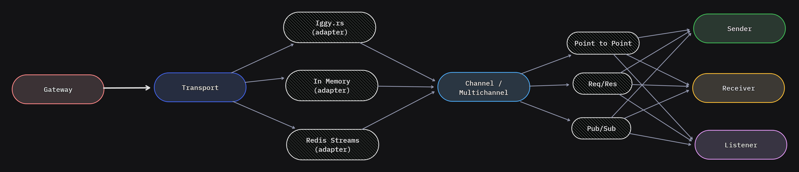
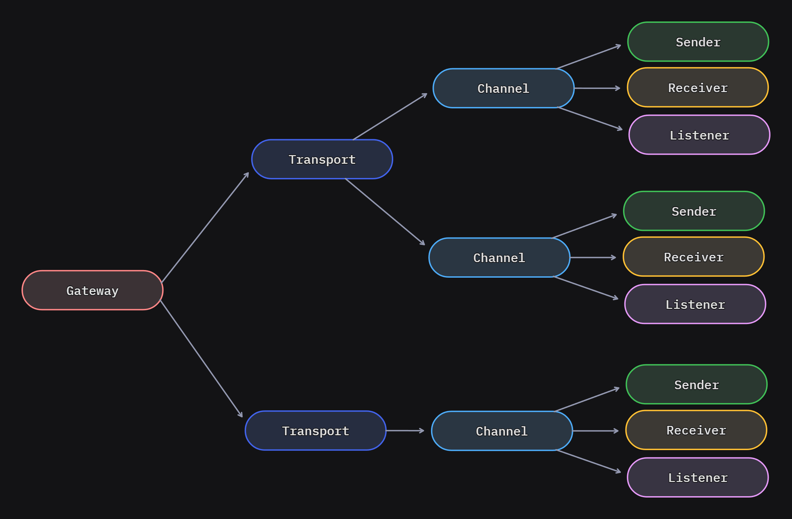

[![Issues][issues-shield]][issues-url]
[![Contributors][contributors-shield]][contributors-url]
[![MIT License][license-shield]][license-url]
[![Stargazers][stars-shield]][stars-url]
[![Forks][forks-shield]][forks-url]

<!-- PROJECT LOGO -->
 

  

<h3 align="center">depesha.</h3>

  

    Runtime agnostic enterprise messaging system library. 
     
    <a href="https://github.com/KonradSajdak/depesha"><strong>Explore the docs »</strong></a>
     
     
    <a href="https://github.com/KonradSajdak/depesha/issues">Report Bug</a>
    ·
    <a href="https://github.com/KonradSajdak/depesha/issues">Request Feature</a>
  

<!-- ABOUT THE PROJECT -->

## About The Project

The main goal of the project is to create a library implementing __message-based system__ integration patterns in TypeScript, enabling the deferral of decisions regarding the infrastructure layer as far into the future as possible. This includes seamless switching between __synchronous__ and __asynchronous communication__, various message transport options such as __in-memory__ and __message brokers__, as well as patterns like __inbox/outbox__, __routing__, and __message transformations__. All of this is intended to be achieved independently of the JavaScript runtime environment (edge too 😎).

<!-- GETTING STARTED -->
## Getting Started

Doesn't have something to show yet. Project is in planning, but on the days will be more, and more 🎉 Planning stuff also. 😎

<!-- CONCEPTS -->
## Concepts

The library is based on the following concepts (abstraction view):

Using multiple transports and channels to communicate between different parts of the system. All based on routing via message headers and static routing configuration.

<!-- FEATURES -->
## Features

This is a list of features that I would like to implement in the future. The list is not exhaustive and may change over time. I want to build a library that is easy to use, but also powerful and flexible.

- [X] Message construction (Envelope Pattern) 
  - [ ] Serialization (JSON, Protobuf, Avro, etc.)
  - [X] Object or Class based (no abstraction)
  - [X] Headers/Envelope
    - [ ] Routing
    - [X] Return Address
    - [X] Consumers Groups
  - [ ] Commands, Events, Queries
- [ ] Composable construction (Builder Pattern?)
- [X] Partitioning / Sharding - native and hybrid support 
- [X] Message bus abstraction for synchronous and asynchronous communication
  - [X] Point-to-Point
  - [X] Publish/Subscribe
  - [X] Request/Response
- [ ] Hybrid-adaptive patterns blocks
  - [ ] Pipes/Middlewares
  - [ ] Channels
  - [ ] Streams
  - [ ] Broadcasters 
- [X] Transports
  - [X] In-memory
    - [X] Ack/Nack
    - [X] Consumers Groups
    - [X] Partitioning
  - [ ] Message brokers/Streaming platforms
    - [ ] Redis Streams
    - [ ] Iggy.rs
    - [ ] Cloudflare Queues
    - [ ] RabbitMQ
    - [ ] Kafka
    - [ ] MQTT (with Cloudflare Pub/Sub)
  - [ ] Databases
    - [ ] MySQL 
    - [ ] SQLite
    - [ ] PostgreSQL
  - [ ] NodeJS Cluster/Threads
  - [ ] HTTP
  - [ ] WebSockets
  - [ ] Browser
- [ ] Pluginable/Extensible (?)
- [ ] Message patterns
  - [ ] Inbox/Outbox
  - [ ] Routing
  - [ ] Message transformation (middlewares?)
- [ ] UI - Visualisation
  - [ ] Message flow
  - [ ] Message routing
  - [ ] Message transformation
- [ ] Playground
- [ ] OpenTelemetry
  - [ ] Logging
  - [ ] Metrics (Prometheus)
  - [ ] Tracing
- [ ] Patterns
  - [ ] Saga/Process Manager/Workflow
  - [ ] CQRS (Read Models, Projections, etc.)
  - [ ] Event Sourcing
  - [ ] Event Store (?)
- [ ] Migrations tools (via message transformation and message routing)
  - [ ] From one transport to another
  - [ ] From one serialization to another
  - [ ] From one message version to another 

<!-- CONTACT -->
## Contact

Konrad Sajdak - [@konradsajdak](https://twitter.com/konradsajdak) - konrad.sajdak@yellowgray.pl

<!-- ACKNOWLEDGMENTS -->
## Acknowledgments

* [Enterprise Integration Patterns](https://www.enterpriseintegrationpatterns.com/)
* [Enterprise Integration Patterns Book](https://www.amazon.com/o/asin/0321200683/ref=nosim/enterpriseint-20)
* [Redis Streams](https://redis.io/docs/data-types/streams/)
* [CrossWS](https://crossws.unjs.io/)
* [Queueable](https://slikts.github.io/queueable/)

<!-- MARKDOWN LINKS & IMAGES -->
<!-- https://www.markdownguide.org/basic-syntax/#reference-style-links -->
[contributors-shield]: https://img.shields.io/github/contributors/KonradSajdak/depesha.svg
[contributors-url]: https://github.com/KonradSajdak/depesha/graphs/contributors
[forks-shield]: https://img.shields.io/github/forks/KonradSajdak/depesha.svg?
[forks-url]: https://github.com/KonradSajdak/depesha/network/members
[stars-shield]: https://img.shields.io/github/stars/KonradSajdak/depesha
[stars-url]: https://github.com/KonradSajdak/depesha/stargazers
[issues-shield]: https://img.shields.io/github/issues/KonradSajdak/depesha
[issues-url]: https://github.com/KonradSajdak/depesha/issues
[license-shield]: https://img.shields.io/github/license/KonradSajdak/depesha
[license-url]: https://github.com/KonradSajdak/depesha/blob/main/LICENSE

## Project analytics

<!-- LICENSE -->
## License

Distributed under the Apache-2.0 license. See `LICENSE` for more information.